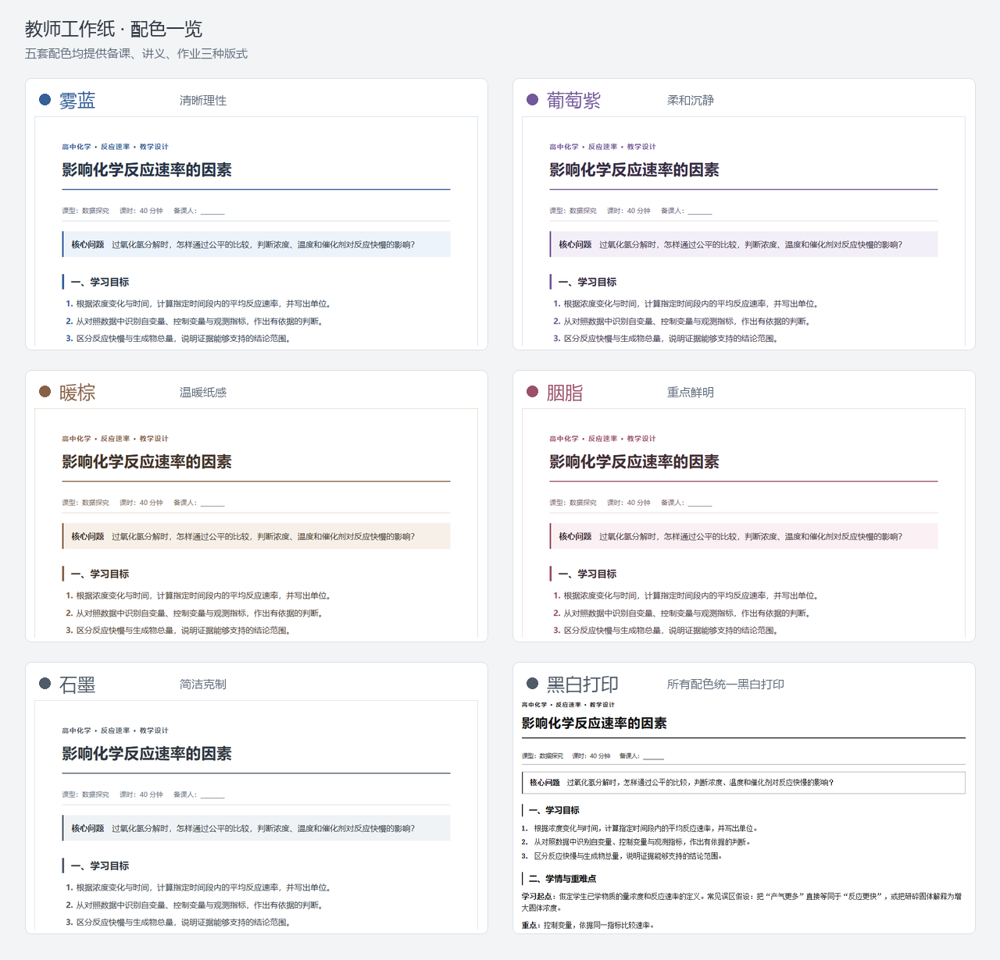

# 教师工作纸 · Typora Themes

面向教师备课、课堂讲义和学生作业的 Typora 主题。五种配色、三种版式，配有高中化学示例与 A4 黑白打印样式。



## 使用

1. 下载本仓库 ZIP 并解压，或克隆仓库。
2. 在 Typora 中打开「偏好设置 → 外观 → 打开主题文件夹」。
3. 将 `themes/` 内喜欢的 `.css` 文件复制进去，重启 Typora。
4. 在「主题」菜单选择「雾蓝备课」「葡萄紫讲义」「石墨作业」等主题。
5. 打开 `templates/` 中的模板，另存为自己的文档后编辑。

下载后双击根目录的 `index.html`，即可离线切换配色和版式。在线预览通过 GitHub Pages 部署；部署状态及地址见仓库的 **Settings → Pages**。

完整安装及排版写法见 [使用说明](docs/USAGE.md)，打印效果见 [两页作业 PDF](docs/samples/worksheet.pdf)。

## 配色与版式

| 配色 | 强调色 | 风格 |
| --- | --- | --- |
| 雾蓝 | `#355f99` | 清晰理性 |
| 葡萄紫 | `#74589a` | 柔和沉静 |
| 暖棕 | `#876047` | 温暖纸感 |
| 胭脂 | `#9b5069` | 重点鲜明 |
| 石墨 | `#505b69` | 简洁克制 |

每种配色均提供 **备课、讲义、作业** 三种版式。另保留原青墨主题的三个兼容文件，共 18 个独立 CSS 文件，无外部字体或脚本依赖。

- 备课：教学环节、过程表格与教师提示，间距舒展。
- 讲义：宋体正文，方便连续阅读和批注。
- 作业：紧凑排版，支持填空线、答题框、订正和手动分页。

打印统一采用黑白配色；表格预留 2px 右侧余量，修复 Chromium 打印时满宽表格右边框被裁切、变淡的问题。

## 高中化学示例

主题为 **《影响化学反应速率的因素》**，包括：

- [教学设计](examples/lesson.md)
- [学习讲义](examples/handout.md)
- [学生作业](examples/worksheet.md)
- [教师参考答案](examples/teacher-notes.md)

练习数据为自编教学示例，非实测记录或实验操作参数。教材版次与年级进度未指定，使用前请按班级情况调整。教师参考答案独立存放，学生版不含答案。

## 开发与验证

需要 Python 3.11+。只构建主题与预览时：

```bash
python -m pip install -r requirements.txt
python scripts/build.py
python scripts/build.py --check
python scripts/package.py
```

`build.py` 以 `src/` 和 `examples/` 为源，生成 `themes/` 及 `index.html`。修改主题时编辑 `src/base.css` 或 `src/palettes.py`，不要只修改生成的 CSS。模板可以直接编辑。

完整浏览器与打印回归检查需要 Chromium 和 Poppler 的 `pdftoppm`：

```bash
python -m pip install -r requirements-dev.txt
python -m playwright install chromium
python scripts/verify.py
```

Windows 安装 Poppler 并将其 `bin` 加入 PATH；Ubuntu 可用 `sudo apt-get install poppler-utils fonts-noto-cjk`。测试覆盖 15 种配色/版式组合、390px 窄屏、打印边框，并验证旧的满宽样式会触发回归失败。诊断文件写入被 Git 忽略的 `artifacts/`。

中文字体在各系统间可能不同，最终分页以实际导出预览为准。浏览器验证不等同于所有 Typora 版本的原生编辑器实测。

## GitHub Pages

在 **Settings → Pages → Source** 中选择 **GitHub Actions**。仓库有权限启用 Pages 后，将仓库变量 `PAGES_ENABLED` 设为 `true`；推送 `main` 或手动运行 CI 工作流，即可测试并部署预览。

私有仓库能否启用 Pages 取决于 GitHub 账号方案。普通 Pages 网站通常可以被公开访问，即使源仓库是私有的。部署产物只包含预览页与主题 CSS，不包含独立教师答案或开发文件；预览页内的示例内容会对访问者可见。

## 目录

```text
src/                 共用 CSS、配色与预览模板
themes/              可直接安装的生成主题
examples/            高中化学 Markdown 示例
templates/           可编辑的空白模板
scripts/             构建、打包与回归检查
docs/                使用说明、截图与打印样例
index.html           可离线打开的预览页
```

## License

[MIT](LICENSE)。允许使用、修改和分发，请保留许可声明。
